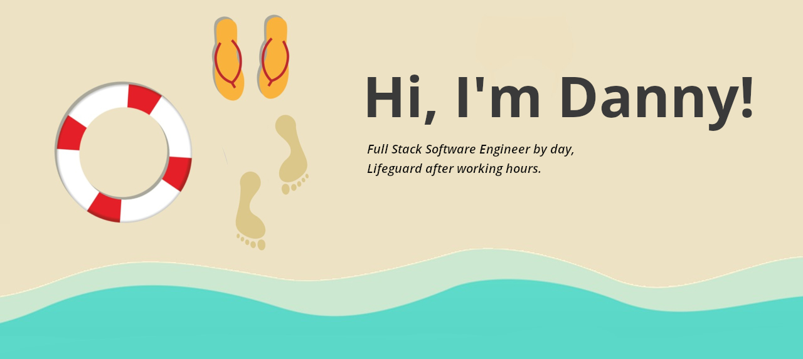

 

 
<a href="#my-github">My Github</a> / <a href="#content-creation">Content creation</a>

<h1></h1>

My name is Danny and I'm an applied university graduated software engineer with a few years of working experience under my belt.

I'm originally from Den Helder 🇳🇱 where I picked up my hobby as lifeguard. I was lucky enough to spend two years in Curaçao 🇨🇼  and two years in Lisbon 🇵🇹  during my high school time. Eventually I moved to Enschede 🇳🇱  for my studies. Now I spend most of my spare time either developing 🖥️  , playing games 🎲 , swimming 🏊  or teaching lifesaving  👨‍🏫

## My GitHub

## Content creation
